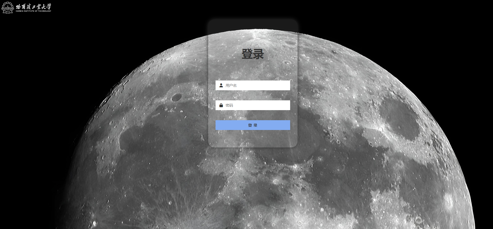
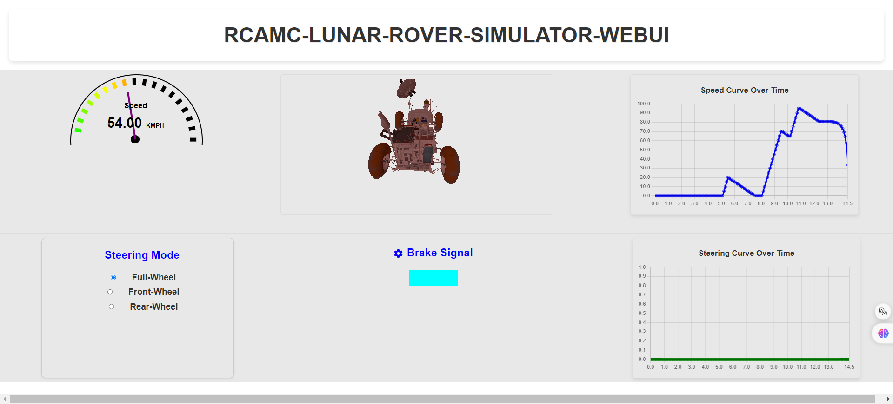

<div style="text-align: center;">
  <h1>Lunar Rover Web UI</h1>
  <p>@Wizard</p>
</div>
<hr>

<div style="text-align: center;">
<h2>Demo</h2>
<h3 >This is demo of index.html</h3>
</img>
<h3 >This is demo of dashboard.html</h3>
</img>
</div>

<div style="text-align: center;">
<h2>Requirements</h2>
</div>

<div class="centered-table" >
    <table align="center">
      <tr>
        <th>Packages</th>
        <th>Version</th>
      </tr>
      <tr>
        <td>Django</td>
        <td>5.0</td>
      </tr>
      <tr>
        <td>FontAwesome</td>
        <td>6.5.2 Form Web</td>
      </tr>
      <tr>
        <td>npm</td>
        <td>20.10.0</td>
      </tr>
      <tr>
        <td>three.js</td>
        <td>1.0.7</td>
      </tr>
      <tr>
        <td>chart.js</td>
        <td>0.1.2</td>
      </tr>
    </table>
  </div>

<div style="text-align: center;">
<h2>Installing</h2>
</div>

- Local
```bash
npm install
npm run dev
```

- Server   

1. run the following in your bash.
```bash
npm run build # get 'dist' dir in your package-dir
scp -r dist.zip servername@serverip:/path # copy the dist.zip to your server
ssh servername@serverip
unzip -o dist.zip -d dist 
sudo apt-get update
sudo apt-get install nginx
```

2. fix your nigix file, the default path is '/etc/nginx/sites-available/default'
``` config
listen your_port default_server;
listen [::]:your_port default_server;
```
3. then restart your nginx server
```bash
sudo service nginx restart
```
4. open your local browser(tested on Chrome)
```
server_ip:your_port
```